<!-- Animated header -->

<!-- Typing animation -->

  

 

<!-- Auto-generated animated terminal -->

  

 

  <em>"Code, ship, monitor, improve - repeat"</em>

<!-- Code, ship, monitor, improve - repeat
Making deployments boring since 2022
Containerize complexity, orchestrate simplicity
Automate the mundane, secure the critical, optimize the rest -->

 

<!-- Profile views counter -->
<!-- 

  

 -->

<!-- Animated footer -->

